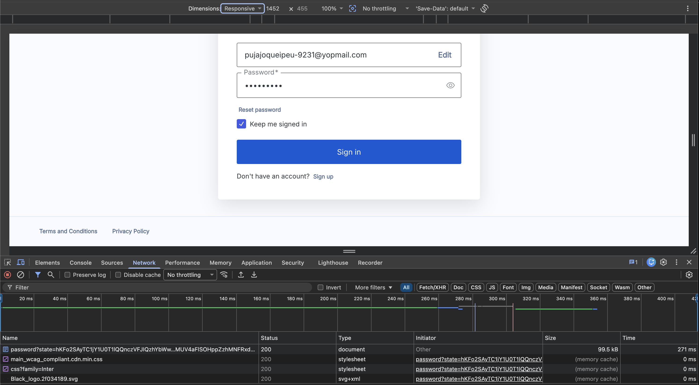

# Part 2: Test Case Design and Bug Reporting

Imagine manually testing the Signup and Login functionality for a web application like https://sleekflow.io.

## 1. Test Case Design

### TC-001: Verify Signup With Valid Email and Password

**Test Objective**  
Verify that a new user can start the signup flow using a valid email, accept the terms, set a valid password, and reach the email confirmation page.

**Preconditions**

- User is on the SleekFlow homepage.
- User has access to a new, unused email address.
- If CAPTCHA appears, tester can read and enter the CAPTCHA manually.

**Test Steps**

1. Open https://sleekflow.io.
2. Click **Start for Free** from the homepage header.
3. Verify the signup page is opened.
4. Enter a valid new email address.
5. Accept the terms and conditions checkbox.
6. If CAPTCHA appears, enter the CAPTCHA code shown on the screen.
7. Click **Sign Up**.
8. Enter a valid password with at least 8 characters and at least 3 of the following: lowercase letter, uppercase letter, number, and special character.
9. Click **Sign Up** again.

**Expected Result**

- The signup form is displayed correctly.
- The user can continue from the email step to the password step.
- After submitting a valid password, the user is redirected to the email confirmation page.
- The page shows a message asking the user to confirm their email address.

### TC-002: Verify Login With Valid Credentials

**Test Objective**  
Verify that an existing user can log in successfully using valid credentials.

**Preconditions**

- User is on the SleekFlow homepage.
- A valid test account already exists.
- The account email has been verified.

**Test Steps**

1. Open https://sleekflow.io.
2. Click **Log In** from the homepage header.
3. Verify the login page is opened.
4. Enter a valid email address.
5. If CAPTCHA appears, enter the CAPTCHA code shown on the screen.
6. Click **Continue**.
7. Verify the password page is displayed.
8. Enter the valid password.
9. Select **Keep me signed in**.
10. Click **Sign In**.

**Expected Result**

- The login page is displayed correctly.
- The user can proceed from the email step to the password step.
- After submitting valid credentials, the user is redirected to the SleekFlow application.
- The inbox page is opened successfully.

### TC-003: Verify Login Error With Invalid Password

**Test Objective**  
Verify that the system shows an error message when a user submits a valid email with an invalid password.

**Preconditions**

- User is on the SleekFlow homepage.
- A valid test account already exists.
- User knows the valid email address but uses an incorrect password.

**Test Steps**

1. Open https://sleekflow.io.
2. Click **Log In** from the homepage header.
3. Verify the login page is opened.
4. Enter a valid email address.
5. If CAPTCHA appears, enter the CAPTCHA code shown on the screen.
6. Click **Continue**.
7. Verify the password page is displayed.
8. Enter an invalid password.
9. Click **Sign In**.

**Expected Result**

- The user remains on the login flow.
- The system displays an error message such as **Wrong username or password**.
- The user is not redirected to the inbox page.
- The password field remains available so the user can retry.

## 2. Bug Reporting

**Bug Title**  
Sign In button does not trigger a login request after submitting valid credentials

**Environment**

- URL: https://sleekflow.io
- Browser: Google Chrome Version 149.0.7827.54 (Official Build) (arm64)
- OS: macOS Tahoe 26.2
- Test account: Existing verified user account

**Steps to Reproduce**

1. Open https://sleekflow.io.
2. Click **Log In**.
3. Enter a valid email address.
4. If CAPTCHA appears, enter the CAPTCHA code shown on the screen.
5. Click **Continue**.
6. Enter the valid password.
7. Open Chrome DevTools and go to the **Network** tab.
8. Clear the network log.
9. Click **Sign In**.

**Expected Result**

- The user should be authenticated successfully.
- The browser should trigger a login/authentication request.
- The user should be redirected to the SleekFlow application inbox page.

**Actual Result**

- Clicking **Sign In** does nothing.
- The user stays on the login page.
- No loading state, validation message, or error message is shown.
- In the **Network** tab, no new login/authentication request is triggered after clicking **Sign In**.
- No API response or error response is returned because the login request is not sent.

**Severity**  
High

Reason: Login is a core user flow. If valid users cannot log in and no error message is shown, users are blocked without any guidance.

**Screenshot**

In the Network tab, no new login/authentication request is triggered after clicking **Sign In**.

## 3. Handle Requirement Misalignment

### What would you do next?

I would first perform 4 failed login attempts and confirm that the account is still not blocked. Then I would perform the 5th failed login attempt and verify whether the account gets locked as stated in the PRD.

If the account is still not blocked after the 5th failed attempt, I would check the browser Network log to confirm that the login API request was triggered 5 times. This helps confirm that the attempts were actually sent to the system and not blocked by the browser, network, validation, or UI behavior.

If the account is still not locked after 5 failed attempts, I would continue testing through the API to help isolate the issue. This would help determine whether the problem is in the frontend flow, such as the UI not sending the correct request payload, or in the backend/authentication service, such as the lockout rule not being enforced.

After that, I would prepare clear reporting evidence, including screenshots or video recording, browser and OS details, test account used, timestamps, and Network log evidence if available.

Then I would compare the behavior against the PRD requirement and check whether there are any additional conditions, such as account type, environment, or feature flag.

### Would you raise a bug immediately? Why or why not?

Yes, I would raise a bug as soon as the issue is confirmed and reproducible.

This behavior can expose the login flow to repeated brute-force attempts, where an attacker keeps trying different passwords until one works. It can also increase unnecessary traffic to the authentication service if repeated attempts are not controlled.

I would include the evidence in the bug report and mark it as a high-priority authentication/security issue.

### Who would you talk to?

I would talk to:

- Product Manager, to confirm what the correct behavior should be.
- Backend engineer, to check why the account is not locked after 5 failed attempts.
- Security team, because this issue can affect login protection.
- QA lead, to confirm the risk and decide whether the release should be blocked.

### Would you block the release? Why?

Yes, I would block the release because unlimited failed login attempts can increase brute-force risk and does not meet the documented PRD behavior.
It can also increase server load and infrastructure cost if someone repeatedly hits the login API with a high number of requests in a short period of time.